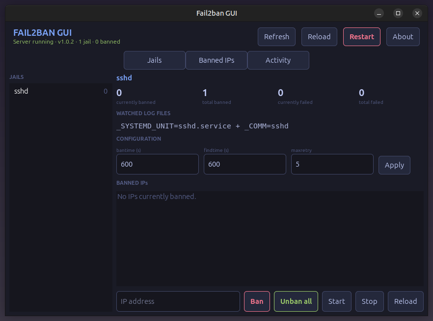

# Fail2ban GUI


A GTK4 desktop front-end for [fail2ban](https://github.com/fail2ban/fail2ban).
fail2ban is great, but its command line is easy to get lost in — this window
turns the everyday operations into buttons and lists.

**Repository:** <https://github.com/effjy/fail2ban-gui/>

C++17 / GTK4 · Tokyo Night theme · minimizes to the system tray.

## Screenshot



> Take a screenshot of the running program and save it as `screenshot.png` in
> the project root to have it appear here.

---

## Features

Manage almost everything you would normally do with `fail2ban-client`, without
touching a terminal:

- **Jails tab** — every jail in a sidebar with its current ban count. Select one to see:
  - currently / total **banned** and **failed** counters,
  - the **watched log files** (or the journald match) the jail reads,
  - **bantime / findtime / maxretry**, editable with *Apply*,
  - the **banned IP list** with a one-click *Unban* per address,
  - *Ban* a new IP, *Unban all*, and *Start* / *Stop* / *Reload* the jail.
- **Banned IPs tab** — every banned address across all jails in one list, each
  with an *Unban* button, plus a box to ban a new IP in a chosen jail.
- **Server controls** in the header — *Reload* and *Restart* the fail2ban
  server, and *Refresh* on demand (the view also auto-refreshes every few seconds).
- **Activity tab** — a timestamped log of every action and how fail2ban answered.
- **System tray** — minimizing or closing the window tucks it into the tray so
  fail2ban stays watched; click the tray icon (or *Show Fail2ban GUI*) to bring
  it back, *Quit* to exit. Where no tray is present, the window behaves normally.
- **About dialog** — under the *About* button in the header.

---

## How privileges work

`fail2ban-client` needs root to reach `/var/run/fail2ban/fail2ban.sock`. Instead
of prompting for every command, the GUI runs unprivileged and launches a small
**root helper once** through `pkexec` — a single authorization for the whole
session. The helper only ever runs `fail2ban-client` with a whitelisted set of
subcommands, never a shell, so it cannot be coaxed into running arbitrary code.
(The helper is just this same binary invoked as `fail2ban-gui --helper`.)

If you cancel the password prompt, the header shows an **Authorize** button —
click it to try again.

---

## 1. Install prerequisites

You need a C++17 compiler, `pkg-config`, the GTK 4 development files, `pkexec`
(from polkit), and of course fail2ban itself.

**Debian / Ubuntu / Mint**
```sh
sudo apt update
sudo apt install build-essential pkg-config libgtk-4-dev fail2ban policykit-1 librsvg2-bin
```

**Fedora / RHEL**
```sh
sudo dnf install gcc-c++ make pkgconf-pkg-config gtk4-devel fail2ban polkit
```

**Arch / Manjaro**
```sh
sudo pacman -S --needed base-devel gtk4 fail2ban polkit
```

Then make sure the fail2ban service is installed and running:
```sh
sudo systemctl enable --now fail2ban
systemctl status fail2ban        # should say "active (running)"
```

---

## 2. Compile

From the project directory:
```sh
make
```
This produces the `fail2ban-gui` binary in place. You can run it straight away
without installing:
```sh
./fail2ban-gui
```

To remove build artifacts:
```sh
make clean
```

---

## 3. Install globally

Installing puts the binary, the application menu entry, and the icon on your
system so **Fail2ban GUI** shows up in your app launcher (and its icon appears
in the window / taskbar):

```sh
sudo make install
```

`make install` writes:

| File | Location |
|------|----------|
| binary | `/usr/local/bin/fail2ban-gui` |
| desktop entry | `/usr/share/applications/fail2ban-gui.desktop` |
| PNG icon | `/usr/share/icons/hicolor/256x256/apps/fail2ban-gui.png` |
| SVG icon | `/usr/share/icons/hicolor/scalable/apps/fail2ban-gui.svg` |

To remove everything again:
```sh
sudo make uninstall
```

---

## 4. Using the program

### Starting it
Launch **Fail2ban GUI** from your application menu, or run `fail2ban-gui` from a
terminal. The first privileged action triggers a single **pkexec** password
prompt; once you authorize, the whole session is covered. The header shows the
server status, version, jail count, and total banned IPs.

### Inspecting a jail
1. Open the **Jails** tab.
2. Pick a jail from the left sidebar — the number next to each name is how many
   IPs it currently has banned.
3. The right panel shows its counters, the log files / journald match it watches,
   its bantime / findtime / maxretry, and the list of currently banned IPs.

### Banning an IP
- **In one jail:** select the jail, type an address in the *IP address* box at
  the bottom of the detail panel, and click **Ban**.
- **From the overview:** on the **Banned IPs** tab, type an address, pick a jail
  from the dropdown, and click **Ban in jail**.

### Unbanning
- Click **Unban** next to any address — in a jail's banned list, or in the
  combined list on the **Banned IPs** tab.
- Click **Unban all** in a jail's detail panel to clear every ban in that jail.

### Changing a jail's thresholds
In a jail's detail panel, edit **bantime** (seconds), **findtime** (seconds), or
**maxretry**, then click **Apply**. New values take effect for subsequent bans.

### Controlling jails and the server
- Per-jail **Start / Stop / Reload** buttons sit in the jail detail panel.
- Header **Reload** re-reads the fail2ban configuration; **Restart** restarts the
  whole server. **Refresh** updates the view immediately (it also refreshes
  automatically every few seconds).

### Keeping it running in the tray
Closing or minimizing the window sends it to the system tray instead of quitting,
so fail2ban stays monitored. Click the tray icon — or **Show Fail2ban GUI** in
its right-click menu — to bring the window back, and **Quit** to exit for good.
The **Activity** tab keeps a running log of everything you did and how fail2ban
responded.

---

## Troubleshooting

- **"Not authorized — click Authorize":** you cancelled (or failed) the pkexec
  prompt. Click **Authorize** in the header to retry.
- **"fail2ban server not responding":** the fail2ban service isn't running —
  start it with `sudo systemctl start fail2ban`.
- **No tray icon:** your desktop has no StatusNotifier tray. The window then just
  closes/quits normally instead of hiding. (KDE has one built in; GNOME needs an
  AppIndicator extension; MATE/XFCE need their notification-area applet.)

---

## License

MIT — see [LICENSE](LICENSE).

Copyright © 2026 **Jean-Francois Lachance-Caumartin**
